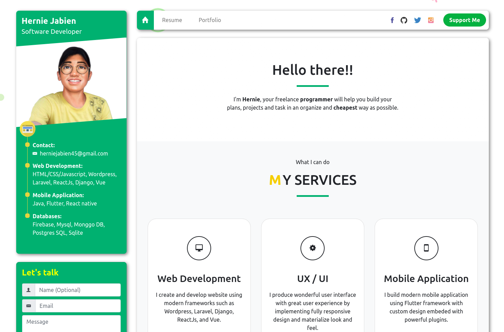

# [ReactJS Portfolio](https://www.hernie-jabien.com)

 
 
  
---
Simple materialize portfolio built in ReactJS
---

This project was built using 
- <b>ReactJS</b> ( Easy to build front-end framework )
- <b>Bootstrap</b> ( Responsive and materialized design )
- <b>Tiny-slider</b> ( Interactive and responsive carousel )
- <b>Emailjs</b> ( Email service )

## Getting Started
### Dependencies:
- <b>Nodejs</b>
( Install [nodejs](https://nodejs.org/en/) )

### In the project directory, you can run:
`npm install`

To install necessary packages

### Then run:
`npm start`

To run the project locally
